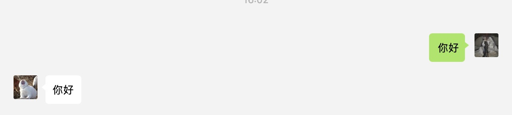

# chatbot
基于关键词触发的微信机器人框架, 支持Python2.7.x和python3（测试环境python2.7.15和python3.7.1）

## 功能
- 识别关键词触发处理函数
- 类falsk的操作，使用装饰器设置关键词
- 聊天信息设置为上下文数据，直接在处理函数中访问

## 版本更新
### 2019-04-12 V1.0
- 关键词触发函数
- 装饰器设置监听
- 聊天信息上下文
### 2019-04-12 V1.1
- 登录方式配置化
- 日志配置化
- 关键词支持正则
### 2019-04-15 V1.2
- 支持Python3版本，兼容Python2.7.x

## 使用方法（若有变动会随版本更新）
**简单开始**
```python
import chatbot

botman = chatbot.Chatbot()

@botman.listen('你好')
def hello():
    return '你好'

if __name__ == "__main__":
    botman.run()
```
登录方式与itchat登录方式一致，扫描二维码即可。  
  

**说明**
使用import引入chatbot，实例化chatbot对象变量botman。  

listen方法设置关键词监听，原型如下:  
```python
listen(self, key_word, isOne=True, isSelf=False, isGroup=False, isAt=False, nickName=None)
```
**key_word**为关键词，匹配某条信息的全部内容，不匹配字串  
**isOne**设置私聊模式，默认为True，只监听私聊信息中别人的聊天内容  
**isSelf**设置本人模式，默认False，监听私聊和群聊中自己的聊天内容  
**isGroup**设置群聊模式，默认False，监听群聊中别人的聊天内容  
**isAt**设置@属性，默认False，在群聊模式中是否要求@触发  
**nickName**私聊模式下，指定nickName的用户触发，输入对方的微信昵称，群聊模式下指定nickName的群聊触发  

处理函数直接返回字符串即可，chatbot将内容发送回当前上下文的聊天窗口；也支持返回元组以支持更多格式:  
```python
@botman.listen('文本')
def text():
    return 'text', 'Hello world!'

@botman.listen('图片')
    return 'image', './hello.jpg'
```
image中返回值元组第二个元素为图片本地路径

**处理函数中获取聊天内容**
```python
@botman.listen('回复')
def back():
    msg = chatbot.context.msg
    return msg.Text.encode('utf-8')
```
context是当前聊天内容上下问，其中msg为本次信息对象，使用线程局部状态thread.local保证多次请求之间上下文隔离。

**配置**
```python
from chatbot import Chatbot
conf = {
    "login_conf": {
        "hotReload": True,
        "statusStorageDir": 'chatbot.pkl',
        "enableCmdQR": False,
        "picDir": None,
        "qrCallback": None,
        "loginCallback": None,
        "exitCallback": None
    },
    "logger_conf": {
        "path": "./default.log",
        "name": "chatbot",
        "format": "%(asctime)s - %(name)s - %(levelname)s - %(message)s",
        "level": "DEBUG"
    }
}
botman = Chatbot(conf=conf)
```

## 使用chatbot开发的服务
- [表情包机器人](example/emoji_robot.md)